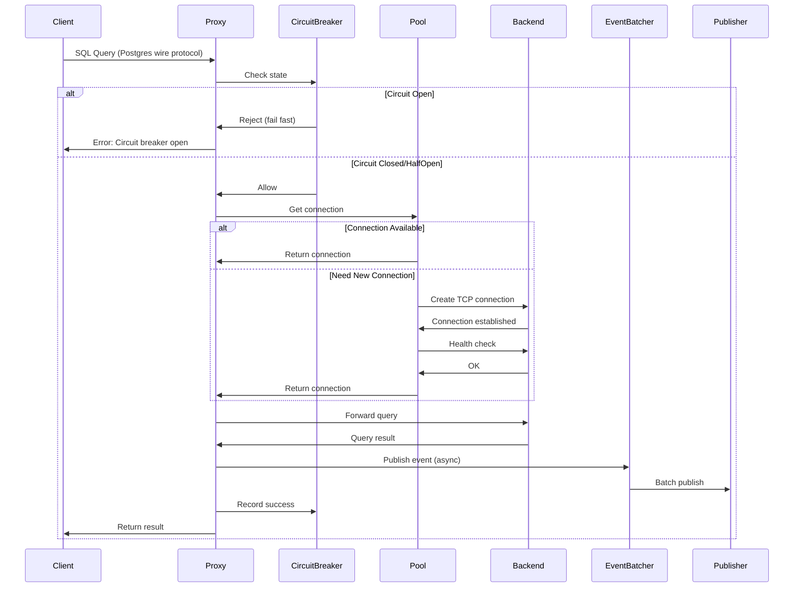
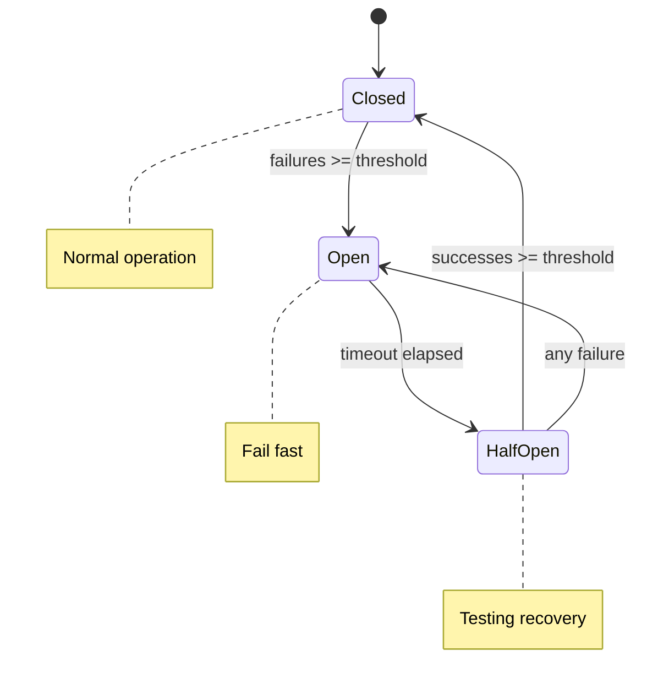

# Architecture

Scry is a transparent proxy for SQL databases built on a high-performance, async architecture designed to add <1ms overhead while providing production-grade observability and resilience.

## Table of Contents

- [High-Level Overview](#high-level-overview)
- [Request Flow](#request-flow)
- [Core Components](#core-components)
- [Module Organization](#module-organization)
- [Async Runtime](#async-runtime)
- [Protocol Handling](#protocol-handling)
- [Performance Characteristics](#performance-characteristics)

## High-Level Overview

Scry sits between your application and database, transparently intercepting and forwarding queries while extracting metadata for observability:

```
┌──────────┐         ┌────────────────────────────┐         ┌──────────┐
│          │         │         Scry Proxy         │         │          │
│  Client  │────────▶│  - Circuit Breaker         │────────▶│ Postgres │
│  (App)   │◀────────│  - Connection Pool         │◀────────│ Database │
│          │         │  - Event Publisher         │         │          │
└──────────┘         └────────────────────────────┘         └──────────┘
                                  │
                                  │ Async (best-effort)
                                  ▼
                     ┌─────────────────────────┐
                     │  Analytics Service      │
                     │  (HTTP + FlexBuffers)   │
                     └─────────────────────────┘
                                  │
                                  │ Scrape
                                  ▼
                     ┌─────────────────────────┐
                     │  Prometheus + Grafana   │
                     └─────────────────────────┘
```

**Key Design Principles**:
- **Transparency**: Drop-in replacement for direct database connection
- **Low Overhead**: <1ms target latency addition through async operations and lock-free data structures
- **Best-Effort Observability**: Events published asynchronously, never block queries
- **Resilience**: Circuit breaker, retries, and health checks protect your database

### Scry vs Traditional Poolers

Scry provides all the connection pooling capabilities of traditional tools like PgBouncer, plus:

- **Query-level observability**: Track every query's latency, success/failure, and anonymized content
- **Predictive health monitoring**: EMA-based anomaly detection catches issues before they cascade
- **Circuit breaking**: Automatic failover when database becomes unhealthy
- **Hot data tracking**: Identify frequently accessed values for cache optimization
- **Timeline breakdown**: See exactly where time is spent (queue, pool, database)

**Protection layer**: Even if your applications have connection pooling, Scry enforces a hard database connection limit, protecting against application bugs, misconfigurations, or poorly-implemented pooling in legacy code.

See [Connection Pooling](connection-pooling.md#scry-vs-traditional-connection-poolers) for detailed comparison.

## Request Flow

Here's how a query flows through Scry from client to database:



### Query Timeline Phases

Every query goes through these measured phases:

1. **Queue Time**: Waiting before pool acquisition starts
2. **Pool Acquire**: Getting a connection from the pool
   - May involve creating new connection
   - May involve waiting for available connection
   - Includes health check and state reset
3. **Backend Execution**: Executing on the database
4. **Event Publishing**: Publishing event to batcher (async, not counted in query latency)

These phases are exposed via `/debug/timeline` and as Prometheus metrics.

## Core Components

### 1. Proxy Server (`src/proxy/server.rs`)

The main entry point that:
- Listens for incoming TCP connections on the proxy port
- Spawns a connection handler for each client
- Manages graceful shutdown with connection draining
- Tracks active connections

**Key Types**:
- `ProxyServer`: Main server struct
- `ConnectionHandler`: Per-connection handler

### 2. Circuit Breaker (`src/resilience/circuit_breaker.rs`)

Lock-free, three-state circuit breaker protecting the backend:



- **Atomic Operations**: Uses `AtomicU8` for state, `AtomicU32` for counters
- **No Locks**: All operations lock-free for <1ms overhead
- **Health Integration**: Works with HealthMonitor for predictive circuit opening

See [Circuit Breaker](circuit-breaker.md) for details.

### 3. Connection Pool (`src/proxy/tcp_pool.rs`)

Protocol-agnostic TCP connection pooling:

```
┌─────────────────────────────────────┐
│      TcpConnectionPool              │
│                                     │
│  ┌──────────┐  ┌──────────┐       │
│  │  Conn 1  │  │  Conn 2  │  ...  │
│  └──────────┘  └──────────┘       │
│                                     │
│  Lifecycle:                         │
│    1. Create → TCP connect          │
│    2. Recycle → Health check + Reset│
│    3. Return to pool                │
└─────────────────────────────────────┘
```

- **Deadpool Integration**: Uses battle-tested `deadpool` for pool management
- **Protocol Agnostic**: Works with any protocol implementing the `Protocol` trait
- **Health Checks**: Passive checks on every recycle
- **State Reset**: Runs `DISCARD ALL` for Postgres to clear session state

See [Connection Pooling](connection-pooling.md) for details.

### 4. Event Publisher (`src/publisher/`)

Trait-based abstraction for publishing query events:

```
┌─────────────┐
│ EventPublisher Trait │
└─────────────┘
      ▲
      │
      ├─── DebugLoggerPublisher (logs as JSON)
      │
      └─── HttpPublisher (HTTP + FlexBuffers)
```

**Event Flow**:
1. Query completes → Create `QueryEvent`
2. Send to `EventBatcher` via bounded channel
3. Batcher accumulates events
4. Flush on size threshold (100 events) OR time threshold (1000ms)
5. Publisher sends batch asynchronously

See [Observability](observability.md) for details.

### 5. Health Monitor (`src/observability/health.rs`)

Predictive health monitoring using EMA baselines:

- Tracks error rate, latency (P99), pool utilization
- Learns baselines over time using Exponential Moving Average
- Warns when current metrics deviate from baseline
- Integrates with Circuit Breaker for predictive failure detection

**Warning Types**:
- Error rate spike (3x baseline)
- Latency spike (2x baseline)
- Pool saturation (>95%)
- Pool starvation (0 available with queued requests)

See [Health Checks](health-checks.md) for details.

### 6. Metrics System (`src/observability/metrics.rs`)

Central metrics singleton tracking all proxy operations:

- **Latencies**: HDR histograms for accurate percentiles
- **Counters**: Atomic counters for queries, errors, circuit breaker state
- **Pool Stats**: Real-time pool utilization
- **Hot Data**: Count-Min Sketch + Top-K heap for frequent value tracking

**Performance**: <300ns overhead per query

See [Metrics](metrics.md) for details.

## Module Organization

```
src/
├── main.rs                    # Entry point, server startup
├── config/                    # Configuration loading (12-factor)
│   └── mod.rs                # Config structs (ProxyConfig, BackendConfig, etc.)
├── proxy/                     # Core proxy logic
│   ├── server.rs             # TCP listener, connection handler
│   ├── tcp_pool.rs           # Connection pooling
│   ├── event_batcher.rs      # Event batching
│   └── protocol/             # Protocol abstraction
│       └── postgres.rs       # Postgres wire protocol
├── protocol/                  # Protocol parsing
│   ├── message.rs            # Message extraction (Query, Parse, etc.)
│   └── anonymize.rs          # Query anonymization
├── publisher/                 # Event publishing
│   ├── trait.rs              # EventPublisher trait
│   ├── event.rs              # QueryEvent struct
│   ├── debug_logger.rs       # Debug logger implementation
│   ├── http_publisher.rs     # HTTP publisher implementation
│   └── flatbuffers_serializer.rs  # FlexBuffers serialization
├── resilience/                # Resilience features
│   ├── circuit_breaker.rs    # Lock-free circuit breaker
│   ├── retry.rs              # Exponential backoff retry
│   └── healthcheck.rs        # Active health checks
└── observability/             # Observability infrastructure
    ├── metrics.rs            # ProxyMetrics singleton
    ├── prometheus.rs         # Prometheus metrics formatting
    ├── health.rs             # HealthMonitor (EMA baselines)
    ├── hot_data.rs           # Hot data tracker (Count-Min Sketch)
    ├── timeline.rs           # Query timeline tracking
    └── metrics_server.rs     # HTTP metrics server
```

## Async Runtime

Scry is built entirely on **Tokio**, the industry-standard async runtime for Rust.

### Why Tokio?

- **Battle-tested**: Powers production systems at Discord, AWS, Microsoft
- **Performance**: M:N threading with work-stealing scheduler
- **Ecosystem**: Rich ecosystem of async libraries (tokio-postgres, deadpool, etc.)
- **Cancellation**: Structured concurrency with graceful cancellation

### Async Patterns

**Connection Handling**:
```rust
tokio::spawn(async move {
    // Each client connection runs in its own task
    handle_connection(client_stream, pool).await
});
```

**Event Batching**:
```rust
tokio::spawn(async move {
    loop {
        tokio::select! {
            Some(event) = rx.recv() => { /* accumulate */ }
            _ = interval.tick() => { /* flush batch */ }
        }
    }
});
```

**Graceful Shutdown**:
```rust
tokio::select! {
    _ = server.run() => {}
    _ = signal::ctrl_c() => {
        // Drain connections, flush events, shutdown
    }
}
```

## Protocol Handling

Scry uses the **Postgres wire protocol** for communication.

### Protocol Layers

```
┌─────────────────────────────┐
│   Application (SQL Query)   │
└─────────────────────────────┘
           ▼
┌─────────────────────────────┐
│  Postgres Wire Protocol     │
│  - Message framing          │
│  - Type tags (Q, P, X, etc.)│
│  - Length prefixes          │
└─────────────────────────────┘
           ▼
┌─────────────────────────────┐
│         TCP                 │
└─────────────────────────────┘
```

### Message Extraction

Scry extracts metadata from these message types:

- **Query ('Q')**: Simple query protocol
  ```
  [Type: 'Q'][Length][Query String][NUL]
  ```

- **Parse ('P')**: Extended query protocol (prepared statements)
  ```
  [Type: 'P'][Length][Statement Name][Query][Param Types]
  ```

- **CommandComplete ('C')**: Query completion with row count
  ```
  [Type: 'C'][Length]["SELECT 5"][NUL]
  ```

- **ErrorResponse ('E')**: Query errors
  ```
  [Type: 'E'][Length][Fields...]
    - 'S': Severity
    - 'M': Message
    - 'C': SQLSTATE code
  ```

See `src/protocol/message.rs` for implementation details.

### Protocol Abstraction

The `Protocol` trait allows Scry to support multiple databases:

```rust
#[async_trait]
pub trait Protocol: Send + Sync {
    async fn connect(&self, addr: SocketAddr) -> Result<TcpStream>;
    async fn health_check(&self, conn: &mut TcpStream) -> Result<()>;
    async fn reset_connection(&self, conn: &mut TcpStream) -> Result<()>;
}
```

**Current**: Postgres via `tokio-postgres`
**Future**: MySQL, MongoDB (via feature flags)

## Performance Characteristics

### Latency Budget

**Target**: <1ms additional latency per query

**Breakdown** (typical):
- Circuit breaker check: 10-50ns (lock-free atomic)
- Pool acquisition: 100-500µs (connection reuse)
- Backend execution: Variable (depends on query)
- Event batching: <100ns (bounded channel send)
- Metrics recording: <300ns (atomic increments + histogram)

**Total Scry Overhead**: ~500µs (0.5ms) typical

### Lock-Free Operations

These critical path operations use no locks:

- **Circuit breaker state transitions**: `AtomicU8::compare_exchange`
- **Metrics counters**: `AtomicU64::fetch_add`
- **Event batching**: `tokio::mpsc::Sender::try_send` (lock-free channel)

### Memory Footprint

Typical memory usage:
- **Base**: ~10MB (Tokio runtime, binary code)
- **Connection pool**: ~50KB per connection
- **Metrics**: ~150KB (histograms, hot data tracker)
- **Event batcher**: ~100KB per 1000 queued events

**Total for 100 connections**: ~20MB

### Throughput

Scry is designed for high throughput:

- **Tested**: 10,000+ queries/sec on commodity hardware
- **Bottleneck**: Usually backend database, not Scry
- **Scaling**: Linear scaling with CPU cores (Tokio work-stealing)

## Design Decisions

### Why Async?

Async allows Scry to handle thousands of concurrent connections with minimal memory:
- **Threads**: 1 thread/connection = 1000 connections = 1000 threads = 8GB+ stack memory
- **Async**: 1000 connections = 1000 tasks = ~8MB memory

### Why Lock-Free?

Locks can cause unpredictable latency spikes. Lock-free atomics ensure:
- **Consistent latency**: No lock contention delays
- **Composability**: Safe to call from any async context
- **Simplicity**: No deadlock concerns

### Why Best-Effort Publishing?

Blocking on event publishing would violate the <1ms latency target:
- Events are buffered in a bounded channel
- Publishing happens asynchronously in background task
- If buffer full, oldest events dropped (ring buffer semantics)
- Query latency remains unaffected

### Why Deadpool?

Deadpool is the standard connection pooling library for Rust async:
- **Battle-tested**: Used in production by thousands of projects
- **Configurable**: Timeouts, sizes, recycle hooks
- **Generic**: Works with any connection type

## See Also

- [Configuration](configuration.md) - Configure all components
- [Observability](observability.md) - Event publishing and batching
- [Circuit Breaker](circuit-breaker.md) - Circuit breaker details
- [Connection Pooling](connection-pooling.md) - Pool management
- [Metrics](metrics.md) - Prometheus metrics
