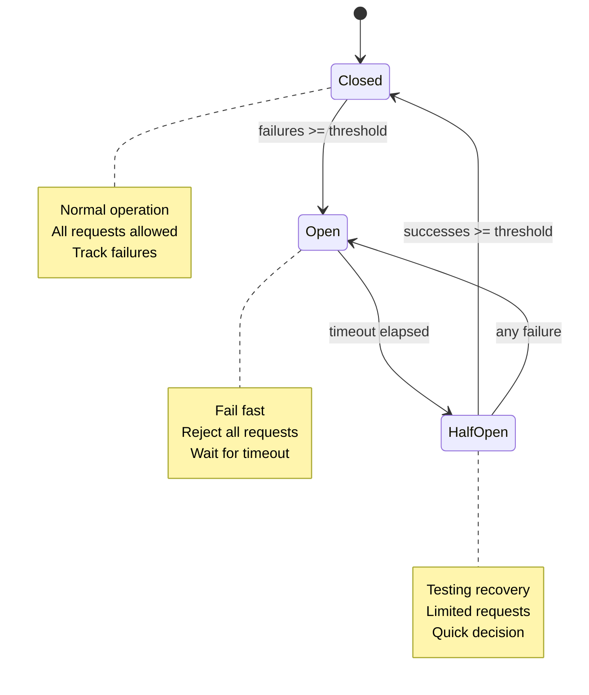

# Circuit Breaker

Scry implements a lock-free, three-state circuit breaker pattern to protect your database from cascading failures and provide fast failure detection with automatic recovery.

## Table of Contents

- [What is a Circuit Breaker?](#what-is-a-circuit-breaker)
- [Why Use a Circuit Breaker?](#why-use-a-circuit-breaker)
- [Three States](#three-states)
- [State Transitions](#state-transitions)
- [Lock-Free Implementation](#lock-free-implementation)
- [Health Monitor Integration](#health-monitor-integration)
- [Configuration](#configuration)
- [Metrics](#metrics)
- [Example Scenarios](#example-scenarios)
- [Best Practices](#best-practices)

## What is a Circuit Breaker?

A circuit breaker is a resilience pattern that prevents an application from repeatedly attempting operations that are likely to fail, protecting both the application and the failing service from additional load.

**Analogy**: Like an electrical circuit breaker that trips to prevent damage during a short circuit, Scry's circuit breaker "trips" (opens) when the database becomes unhealthy, failing requests quickly instead of waiting for timeouts.

### Without Circuit Breaker

```
Client → Proxy → Database (Down)
         ↓
    Wait 5 seconds (timeout)
         ↓
    Return error
         ↓
    Repeat for every request
```

**Problems**:
- Every request waits for full timeout
- Resources tied up waiting
- Database experiences continued failed connection attempts
- Poor user experience (slow error responses)

### With Circuit Breaker

```
Client → Proxy → Circuit Breaker (Open)
         ↓
    Immediate error (fail fast)
         ↓
    No database connection attempt
```

**Benefits**:
- Fast failure (milliseconds vs seconds)
- No wasted resources on doomed requests
- Database protected from connection flood
- Automatic recovery testing

## Why Use a Circuit Breaker?

1. **Fast Failure**: Return errors in <1ms instead of waiting for timeouts
2. **Resource Protection**: Don't waste connection pool on failing connections
3. **Database Protection**: Reduce load on struggling database
4. **Automatic Recovery**: Automatically test for recovery and restore service
5. **Graceful Degradation**: Provide better error messages during outages

## Three States



### Closed State

**Normal operation** - Database is healthy

- All requests **allowed** through
- Track consecutive failures
- Transition to **Open** if failures exceed threshold

**Example**:
```
Request 1: ✓ Success (failures: 0)
Request 2: ✓ Success (failures: 0)
Request 3: ✗ Failure (failures: 1)
Request 4: ✓ Success (failures: 0, reset)
Request 5: ✗ Failure (failures: 1)
Request 6: ✗ Failure (failures: 2)
Request 7: ✗ Failure (failures: 3)
Request 8: ✗ Failure (failures: 4)
Request 9: ✗ Failure (failures: 5) → Circuit OPENS
```

### Open State

**Fail fast** - Database is down/unhealthy

- All requests **rejected** immediately
- No connection attempts to database
- Wait for `open_timeout_secs`
- Transition to **HalfOpen** after timeout

**Example**:
```
Circuit opened at: 10:00:00
open_timeout_secs: 60

Request 10 (10:00:01): ✗ Rejected (circuit open)
Request 11 (10:00:05): ✗ Rejected (circuit open)
Request 12 (10:00:30): ✗ Rejected (circuit open)
Request 13 (10:01:01): → Circuit transitions to HalfOpen
```

### HalfOpen State

**Testing recovery** - Probing if database is healthy again

- **Limited requests** allowed through
- Track consecutive successes
- Transition to **Closed** if successes exceed threshold
- Transition to **Open** on any failure (fail fast)

**Example Success Path**:
```
Circuit halfopen at: 10:01:00

Request 13: ✓ Success (successes: 1)
Request 14: ✓ Success (successes: 2) → Circuit CLOSES
Request 15: ✓ Success (normal operation resumes)
```

**Example Failure Path**:
```
Circuit halfopen at: 10:01:00

Request 13: ✓ Success (successes: 1)
Request 14: ✗ Failure → Circuit OPENS immediately
```

## State Transitions

### Closed → Open

**Triggers**:
1. **Failure threshold reached**: `consecutive_failures >= failure_threshold`
2. **Health monitor unhealthy** (if enabled): `use_health_monitor && health_status == Unhealthy`

**Example**:
```toml
[resilience.circuit_breaker]
failure_threshold = 5
```

After 5 consecutive failures, circuit opens.

### Open → HalfOpen

**Trigger**: `time_since_opened >= open_timeout_secs`

**Example**:
```toml
[resilience.circuit_breaker]
open_timeout_secs = 60
```

After 60 seconds in Open state, circuit transitions to HalfOpen.

### HalfOpen → Closed

**Trigger**: `consecutive_successes >= success_threshold`

**Example**:
```toml
[resilience.circuit_breaker]
success_threshold = 2
```

After 2 consecutive successful requests, circuit closes (normal operation).

### HalfOpen → Open

**Trigger**: Any failure in HalfOpen state

This prevents partially-recovered systems from being overwhelmed.

## Lock-Free Implementation

Scry's circuit breaker uses **atomic operations** for <1ms overhead.

### Data Structures

```rust
pub struct CircuitBreaker {
    // State: 0=Closed, 1=Open, 2=HalfOpen
    state: AtomicU8,

    // Consecutive failures (Closed state)
    consecutive_failures: AtomicU32,

    // Consecutive successes (HalfOpen state)
    consecutive_successes: AtomicU32,

    // Timestamp when circuit opened (unix epoch seconds)
    opened_at: AtomicU64,

    // Configuration
    config: CircuitBreakerConfig,

    // Health monitor integration
    health_monitor: Option<Arc<HealthMonitor>>,
}
```

### Atomic Operations

**Check if request allowed** (lock-free):
```rust
pub fn is_request_allowed(&self) -> bool {
    let state = self.state.load(Ordering::Acquire);

    match CircuitState::from_u8(state) {
        Closed => true,
        Open => {
            // Check if should transition to HalfOpen
            let now = SystemTime::now().duration_since(UNIX_EPOCH).unwrap().as_secs();
            let opened_at = self.opened_at.load(Ordering::Acquire);

            if now - opened_at >= self.config.open_timeout_secs {
                // Try to transition to HalfOpen
                self.state.compare_exchange(
                    Closed as u8,
                    HalfOpen as u8,
                    Ordering::AcqRel,
                    Ordering::Acquire
                ).is_ok()
            } else {
                false  // Still open
            }
        }
        HalfOpen => true,  // Allow limited requests
    }
}
```

**Record success** (lock-free):
```rust
pub fn record_success(&self) {
    let state = self.state.load(Ordering::Acquire);

    match CircuitState::from_u8(state) {
        Closed => {
            // Reset consecutive failures
            self.consecutive_failures.store(0, Ordering::Release);
        }
        HalfOpen => {
            // Increment successes
            let successes = self.consecutive_successes.fetch_add(1, Ordering::AcqRel) + 1;

            if successes >= self.config.success_threshold {
                // Try to close circuit
                self.state.compare_exchange(
                    HalfOpen as u8,
                    Closed as u8,
                    Ordering::AcqRel,
                    Ordering::Acquire
                );
            }
        }
        Open => {}  // Ignored
    }
}
```

### Performance

- **Check allowed**: ~10-50ns (single atomic load)
- **Record success**: ~10-50ns (atomic store or fetch_add)
- **State transition**: ~50-100ns (compare_exchange)

**No locks**, **no waiting**, **predictable latency**.

## Health Monitor Integration

When enabled (`use_health_monitor = true`), the circuit breaker can open **predictively** based on health monitoring:

```rust
if use_health_monitor {
    let health_status = health_monitor.status();

    if health_status == Unhealthy {
        // Open circuit proactively
        self.state.store(Open as u8, Ordering::Release);
    }
}
```

### Health Status Levels

| Status | Description | Circuit Behavior |
|--------|-------------|------------------|
| **Healthy** | No warnings | Normal operation |
| **Degraded** | Minor warnings | Normal operation |
| **Unhealthy** | Critical warnings | **Open circuit** |

### Critical Warnings (trigger Unhealthy)

1. **Pool starvation**: No available connections with waiting requests
2. **Pool saturation**: >99% pool utilization
3. **Error rate spike**: Current error rate >5x baseline

**Benefit**: Circuit opens **before** hitting failure threshold, protecting database earlier.

See [Health Checks](health-checks.md) for details.

## Configuration

### Parameters

| Parameter | Type | Default | Description |
|-----------|------|---------|-------------|
| `enabled` | bool | `true` | Enable circuit breaker |
| `failure_threshold` | u32 | `5` | Consecutive failures to open circuit |
| `success_threshold` | u32 | `2` | Consecutive successes to close circuit |
| `window_secs` | u64 | `30` | Time window for failure counting (not used in current implementation) |
| `open_timeout_secs` | u64 | `60` | Seconds before transitioning to HalfOpen |
| `use_health_monitor` | bool | `true` | Enable predictive opening via health monitor |

### Configuration File

```toml
[resilience.circuit_breaker]
enabled = true
failure_threshold = 5
success_threshold = 2
window_secs = 30
open_timeout_secs = 60
use_health_monitor = true
```

### Environment Variables

```bash
export SCRY_RESILIENCE__CIRCUIT_BREAKER__ENABLED=true
export SCRY_RESILIENCE__CIRCUIT_BREAKER__FAILURE_THRESHOLD=5
export SCRY_RESILIENCE__CIRCUIT_BREAKER__SUCCESS_THRESHOLD=2
export SCRY_RESILIENCE__CIRCUIT_BREAKER__OPEN_TIMEOUT_SECS=60
export SCRY_RESILIENCE__CIRCUIT_BREAKER__USE_HEALTH_MONITOR=true
```

### Tuning Guidelines

**Sensitive (fail fast)**:
```toml
failure_threshold = 3       # Open quickly
success_threshold = 3       # More confidence before closing
open_timeout_secs = 30      # Test recovery frequently
```

**Tolerant (avoid false positives)**:
```toml
failure_threshold = 10      # More failures allowed
success_threshold = 2       # Quick to close
open_timeout_secs = 120     # Give database more recovery time
```

**Development**:
```toml
failure_threshold = 3
open_timeout_secs = 10      # Fast recovery for local testing
```

## Metrics

### Prometheus Metrics

```bash
curl http://localhost:9090/metrics | grep circuit_breaker
```

```
# Circuit breaker state (0=Closed, 1=Open, 2=HalfOpen)
scry_circuit_breaker_state 0

# Consecutive failures (in Closed state)
scry_circuit_breaker_consecutive_failures 0

# Consecutive successes (in HalfOpen state)
scry_circuit_breaker_consecutive_successes 0

# Total requests allowed through
scry_circuit_breaker_requests_allowed_total 1234

# Total requests rejected (circuit open)
scry_circuit_breaker_requests_rejected_total 56
```

### Monitoring Alerts

**Circuit opened** (database issues):
```promql
scry_circuit_breaker_state == 1
```

**Frequent rejections** (circuit often open):
```promql
rate(scry_circuit_breaker_requests_rejected_total[5m]) > 10
```

**Circuit flapping** (unstable database):
```promql
changes(scry_circuit_breaker_state[5m]) > 5
```

## Example Scenarios

### Scenario 1: Database Outage

**Timeline**:
```
10:00:00 - Database crashes
10:00:01 - Request 1: ✗ Connection refused (failures: 1)
10:00:02 - Request 2: ✗ Connection refused (failures: 2)
10:00:03 - Request 3: ✗ Connection refused (failures: 3)
10:00:04 - Request 4: ✗ Connection refused (failures: 4)
10:00:05 - Request 5: ✗ Connection refused (failures: 5)
         - Circuit OPENS
10:00:06 - Request 6: ✗ Rejected (circuit open) - <1ms response
10:00:07 - Request 7: ✗ Rejected (circuit open) - <1ms response
...
10:01:05 - 60 seconds elapsed, circuit → HalfOpen
10:01:06 - Request N: Allowed through, tests database
         - ✗ Still down, circuit → Open immediately
10:02:06 - 60 seconds elapsed, circuit → HalfOpen
10:02:07 - Database restored
10:02:07 - Request M: ✓ Success (successes: 1)
10:02:08 - Request N: ✓ Success (successes: 2)
         - Circuit CLOSES, normal operation resumes
```

**Benefits**:
- Requests 6+ fail in <1ms (vs 5 second timeout)
- Database not overwhelmed by connection attempts
- Automatic recovery testing every 60 seconds
- Automatic service restoration when database recovers

### Scenario 2: Temporary Network Blip

**Timeline**:
```
10:00:00 - Network hiccup
10:00:01 - Request 1: ✗ Timeout (failures: 1)
10:00:02 - Request 2: ✗ Timeout (failures: 2)
10:00:03 - Network recovers
10:00:04 - Request 3: ✓ Success (failures: 0, reset)
10:00:05 - Normal operation continues
```

**Benefit**: Circuit stays Closed, no false positive

### Scenario 3: Slow Degradation

**Timeline** (with health monitor):
```
10:00:00 - Database starts slowing down
10:00:05 - Health monitor detects latency spike (2x baseline)
         - Status: Degraded (circuit stays Closed)
10:00:10 - Pool saturation reaches 99%
         - Health monitor: Unhealthy
         - Circuit → Open (predictive)
10:00:11 - Requests fail fast (<1ms)
10:01:10 - Circuit → HalfOpen
         - Database recovered during break
10:01:11 - Requests succeed, circuit → Closed
```

**Benefit**: Circuit opens **before** failures cascade

## Best Practices

### 1. Enable Health Monitor Integration

```toml
[resilience.circuit_breaker]
use_health_monitor = true
```

This enables predictive circuit opening based on health metrics.

### 2. Set Appropriate Thresholds

Too sensitive:
- False positives during brief issues
- Frequent circuit flapping
- Poor user experience

Too tolerant:
- Slow to detect outages
- Resources wasted on failing requests
- Database not protected

**Recommendation**: Start with defaults, tune based on metrics.

### 3. Monitor Circuit State

Alert on circuit state changes:
```promql
changes(scry_circuit_breaker_state[5m]) > 0
```

Investigate:
- Why circuit opened (database issues?)
- How long it stayed open
- Rejection rate during outage

### 4. Coordinate with Retry Logic

Circuit breaker works with retry logic:
1. Retry attempts connection
2. Circuit breaker rejects if open
3. Retry fails fast without hitting database

See [Resilience](resilience.md) for integration.

### 5. Test Circuit Breaker

Simulate database outage:
```bash
# Stop database
just postgres-down

# Trigger requests
for i in {1..10}; do
  psql -h 127.0.0.1 -p 5433 -U postgres -c "SELECT 1" 2>&1 | grep -q "circuit" && echo "Circuit open at request $i"
done

# Check metrics
curl http://localhost:9090/metrics | grep circuit_breaker_state

# Restart database
just postgres-up

# Watch circuit recover
watch -n 1 'curl -s http://localhost:9090/metrics | grep circuit_breaker_state'
```

### 6. Provide Meaningful Errors

When circuit is open, return clear error messages to users:

```
Error: Service temporarily unavailable due to database issues.
Please try again in a few moments.

Circuit breaker is open - automatic recovery in progress.
```

## See Also

- [Health Checks](health-checks.md) - Health monitor integration
- [Resilience](resilience.md) - Complete resilience features
- [Connection Pooling](connection-pooling.md) - Pool integration
- [Metrics](metrics.md) - Circuit breaker metrics
- [Configuration](configuration.md) - Configuration reference
