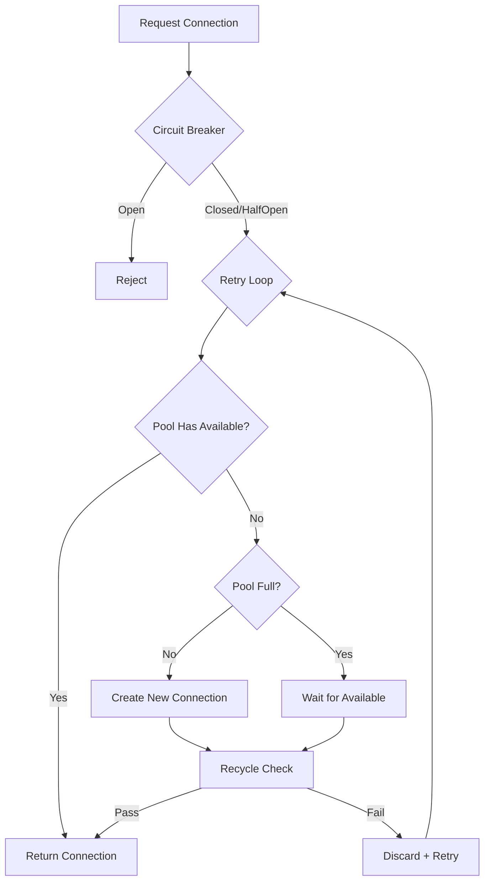

# Connection Pooling

Scry implements protocol-agnostic connection pooling to efficiently manage backend database connections, reducing latency and resource usage while maintaining connection health and state consistency.

## Table of Contents

- [Why Connection Pooling?](#why-connection-pooling)
- [Scry vs Traditional Connection Poolers](#scry-vs-traditional-connection-poolers)
- [Architecture](#architecture)
- [Connection Lifecycle](#connection-lifecycle)
- [Configuration](#configuration)
- [Pool Metrics](#pool-metrics)
- [Performance Tuning](#performance-tuning)
- [Troubleshooting](#troubleshooting)

## Why Connection Pooling?

Without pooling, every query requires:
1. TCP connection establishment (3-way handshake)
2. TLS handshake (if enabled)
3. Database authentication
4. Query execution
5. Connection teardown

**Cost per query**: 10-50ms overhead just for connection setup

With pooling:
1. Query execution (reuse existing connection)

**Cost per query**: <1ms overhead

### Benefits

- **Reduced Latency**: Reuse existing connections instead of creating new ones
- **Lower Resource Usage**: Maintain fixed pool of connections vs creating per-request
- **Better Control**: Limit total connections to database
- **Health Management**: Automatic health checks and state resets
- **Resilience**: Integration with circuit breaker and retry logic

## Scry vs Traditional Connection Poolers

### How Scry Compares to PgBouncer

Scry provides the same connection pooling capabilities as traditional poolers like PgBouncer, but with significant advantages:

| Feature | PgBouncer | Scry |
|---------|-----------|------|
| Connection Pooling | ✓ | ✓ |
| Connection Reuse | ✓ | ✓ |
| Per-Query Metrics | ✗ | ✓ |
| Query Anonymization | ✗ | ✓ |
| Hot Data Detection | ✗ | ✓ |
| Circuit Breaker | ✗ | ✓ |
| Active Health Checks | Basic | Advanced (EMA-based anomaly detection) |
| Retry Logic | ✗ | ✓ (exponential backoff with jitter) |
| Observability Events | ✗ | ✓ (batched event publishing) |
| Query Timeline Breakdown | ✗ | ✓ (queue/pool/backend phases) |
| Prometheus Metrics | Basic | Comprehensive (percentiles, pool, circuit breaker) |

**Bottom Line**: Scry is a modern replacement for PgBouncer that adds production-grade observability while maintaining the same connection pooling efficiency.

### Why Proxy-Level Pooling Matters

**Even if your application has connection pooling**, a proxy-level pool like Scry provides critical advantages:

#### 1. Defense Against Connection Explosions

Applications can misbehave and create too many connections:

```
App Instance 1: 50 connections (configured pool size)
App Instance 2: 50 connections
App Instance 3: 200 connections (BUG: pool leak!)
App Instance 4: 50 connections

Total: 350 connections → Database overwhelmed
```

With Scry:
```
App Instance 1 → ┐
App Instance 2 → ├→ Scry (pool: 100) → Database (100 connections max)
App Instance 3 → ├→ Protects database from app bugs
App Instance 4 → ┘
```

**Scry enforces a hard limit**, protecting your database even when applications have bugs or misconfigurations.

#### 2. Centralized Observability

Application-level pools give you per-instance metrics. Scry gives you **centralized visibility**:

- See total query load across all applications
- Detect slow queries from any service
- Identify hot data patterns across your entire system
- Track pool utilization for the entire database

#### 3. Multi-Language Environments

Different languages/frameworks may have different pooling quality:

- Node.js app: Good pooling library
- Python app: Mediocre pooling configuration
- Legacy Java app: No pooling (creates connections per request!)
- PHP app: No persistent connections

**Scry provides consistent pooling** regardless of application implementation.

#### 4. Deploy-Time Flexibility

With proxy-level pooling:
- **Scale applications** independently without reconfiguring database
- **Add new services** without coordinating connection limits
- **Change pool settings** without redeploying applications
- **Roll out connection pooling** to legacy apps without code changes

### When to Use Scry

**Use Scry when you want**:
- Comprehensive observability into database queries
- Protection against application connection leaks
- Circuit breaking and automatic retry logic
- Centralized connection management across multiple applications
- Query anonymization for compliance
- Hot data detection for cache optimization

**You can use Scry even if**:
- Your applications already have connection pooling
- You're already using a traditional pooler (Scry is a better replacement)
- You have just one application (observability still valuable)

## Architecture

Scry uses **deadpool** for connection pool management with custom lifecycle hooks:

```
┌──────────────────────────────────────────────┐
│         TcpConnectionPool                    │
│                                              │
│  ┌──────────┐  ┌──────────┐  ┌──────────┐  │
│  │  Conn 1  │  │  Conn 2  │  │  Conn 3  │  │
│  │ (Active) │  │ (Idle)   │  │ (Idle)   │  │
│  └──────────┘  └──────────┘  └──────────┘  │
│                                              │
│  Max Size: 100                               │
│  Available: 2                                │
│  In Use: 1                                   │
│                                              │
│  Lifecycle Hooks:                            │
│    • create()    → TCP connect               │
│    • recycle()   → Health check + Reset      │
│                                              │
│  Integration:                                │
│    • Circuit Breaker (check before get)      │
│    • Retry Logic (exponential backoff)       │
│    • Health Monitor (track pool state)       │
└──────────────────────────────────────────────┘
```

### Protocol-Agnostic Design

The pool works with any protocol implementing the `Protocol` trait:

```rust
#[async_trait]
pub trait Protocol: Send + Sync {
    /// Connect to backend
    async fn connect(&self, addr: SocketAddr) -> Result<TcpStream>;

    /// Check connection health
    async fn health_check(&self, conn: &mut TcpStream) -> Result<()>;

    /// Reset connection state
    async fn reset_connection(&self, conn: &mut TcpStream) -> Result<()>;
}
```

**Current**: Postgres via `tokio-postgres`
**Future**: MySQL, MongoDB (via feature flags)

## Connection Lifecycle

### 1. Creation

When pool needs a new connection:

```
Request → Pool → Need Connection? → Create
                                      ↓
                                 TCP Connect
                                      ↓
                                 TLS Handshake (if enabled)
                                      ↓
                                 Auth
                                      ↓
                                 Add to Pool
```

**Implementation** (`TcpStreamManager::create`):
```rust
async fn create(&self) -> Result<TcpStream> {
    let stream = TcpStream::connect(self.backend_addr).await?;
    // Connection ready for use
    Ok(stream)
}
```

### 2. Acquisition (Get from Pool)



**Integration Points**:
1. **Circuit Breaker**: Reject if circuit open
2. **Retry Logic**: Retry on failure with backoff
3. **Metrics**: Record pool acquisition time

### 3. Recycling (Return to Pool)

Before returning connection to pool for reuse:

```
Return Connection → Recycle Hook
                        ↓
                   Health Check
                        ↓
                   ┌────┴────┐
                   │ Healthy │
                   └────┬────┘
                        ↓
                   Reset State (DISCARD ALL)
                        ↓
                   Return to Pool
```

**Implementation** (`TcpStreamManager::recycle`):
```rust
async fn recycle(&self, conn: &mut TcpStream) -> RecycleResult {
    // 1. Health check
    if let Err(e) = self.protocol.health_check(conn).await {
        return Err(RecycleError::StaticMessage("Health check failed"));
    }

    // 2. Reset connection state
    if let Err(e) = self.protocol.reset_connection(conn).await {
        return Err(RecycleError::StaticMessage("State reset failed"));
    }

    Ok(())
}
```

#### For Postgres: DISCARD ALL

The `DISCARD ALL` command resets all session state:
- Temporary tables
- Prepared statements
- Session variables
- Transaction state
- Cursors
- Advisory locks

This ensures connections are "clean" for the next query, preventing state leakage between different clients.

> **Note (Transaction mode, restrict-by-pinning — P2 §4.5):** because `DISCARD ALL` on recycle
> destroys any cached **prepared statements** (and a `LISTEN` registration is inherently
> session-local), Scry does **not** release a Transaction-mode connection that still carries them.
> Such a connection is pinned 1:1 to its client (`should_release_connection` in
> `src/proxy/connection.rs`) so the state is never silently dropped. The tradeoff: prepared-heavy
> or `LISTEN`-using clients get **less pooling** in Transaction mode. Stateless clients pool as
> before. See [transparency-contract.md §4](transparency-contract.md#4-pooling-mode-scope).

#### Graceful client disconnect: Terminate is intercepted, not forwarded (P2 §5.3)

A well-behaved Postgres client sends a `Terminate` ('X') message before closing its socket. In
the **pooled path**, Scry does **not** forward that `Terminate` to the backend — forwarding it
would close the physical Postgres session, so the pooled connection could never be **warm-reused**
by a different client (every new client would pay a full TCP connect + startup + authentication).
Instead the proxy treats `Terminate` as "this client is done", ends the client's session, and
returns the still-alive backend to the pool. `Terminate` is the one client message Scry
deliberately does not forward, because it is a connection-lifecycle signal the pool owns; every
other message is forwarded transparently. (The non-pooled/owned path still forwards `Terminate`
1:1.) This is implemented in the managed client-read loop in `src/proxy/connection.rs`.

What makes warm reuse **clean**: the surviving backend goes through the same recycle sequence
before the next client checks it out — **`health_check` → `DISCARD ALL` (reset) → reuse**. The
`health_check` rejects a desynced/dead connection (falling back to creating a fresh one), and
`DISCARD ALL` wipes all session state (temp tables, prepared statements, `SET` variables, advisory
locks, cursors, `LISTEN`), so the next client sees a pristine session on a genuinely reused
backend process. This is verified end-to-end by the §5.3 dirty-connection auditor
(`tests/differential_transparency_test.rs`), which confirms via matching `pg_backend_pid()` across
two client connections that the **same** physical backend is reused, and that none of the first
client's state is observable to the second.

Because a Postgres backend performs its startup/authentication exactly once and then stays in the
query loop for life, a warm-reused backend is **not** re-initialized. The proxy captures the
backend's client-facing startup response (`ParameterStatus`, `BackendKeyData`, `ReadyForQuery`) on
first initialization (stored on the pooled connection) and **replays** it to any later client that
reuses the same physical backend, while authenticating that client normally — so the client's
startup sequence stays faithful without ever re-handshaking the backend.

### 4. Health Checks (Passive)

Every connection is health-checked **before** being returned from the pool:

**Postgres Health Check**:
```sql
SELECT 1
```

If health check fails:
- Connection discarded
- Pool creates new connection
- Retry logic applies

This is **passive health checking** (on-demand, during acquisition).

See [Health Checks](health-checks.md) for **active health checking** (periodic background checks).

## Configuration

### Pool Settings

| Parameter | Default | Description |
|-----------|---------|-------------|
| `pool_size` | 50 | Maximum backend connections in pool |
| `pool_min_idle` | 5 | Minimum idle connections to maintain |
| `pool_queue_depth` | 500 | Maximum clients waiting for a connection |
| `pool_timeout_secs` | 30 | Timeout waiting for available connection |
| `connection_timeout_ms` | 5000 | Timeout for creating new connection |
| `pool_ratio_warning_threshold` | 20 | Warn if max_connections/pool_size exceeds this |

Configure via environment variables or config file:

```toml
[performance]
pool_size = 50
pool_min_idle = 10
pool_queue_depth = 500
pool_ratio_warning_threshold = 20
```

```bash
export SCRY_PERFORMANCE__POOL_SIZE=50
export SCRY_PERFORMANCE__POOL_MIN_IDLE=10
export SCRY_PERFORMANCE__POOL_QUEUE_DEPTH=500
```

### Startup Validation

Scry automatically validates pool configuration at startup and warns about potential issues:

- **High multiplexing ratio**: If `max_connections / pool_size > pool_ratio_warning_threshold`, Scry warns that clients may experience long wait times
- **Small queue depth**: If `pool_queue_depth < (max_connections - pool_size) / 2`, Scry warns that the queue may be too small for expected demand
- **Wasteful configuration**: If `pool_size > max_connections`, Scry warns that pool connections will be wasted

Set `pool_ratio_warning_threshold = 0` to disable ratio warnings.

### Sizing Guidelines

**Formula**: `pool_size ≥ (peak_qps * avg_query_latency_secs) + buffer`

**Examples**:

**Low Traffic** (100 qps, 10ms avg latency):
```
pool_size = (100 * 0.01) + 5 = 6
→ Recommend: 10
```

**Medium Traffic** (1000 qps, 10ms avg latency):
```
pool_size = (1000 * 0.01) + 10 = 20
→ Recommend: 30
```

**High Traffic** (10000 qps, 10ms avg latency):
```
pool_size = (10000 * 0.01) + 20 = 120
→ Recommend: 150
```

**High Latency** (1000 qps, 100ms avg latency):
```
pool_size = (1000 * 0.1) + 20 = 120
→ Recommend: 150
```

### Pool Saturation

Pool saturates when all connections are in use and new requests must wait.

**Symptoms**:
- Increased query latency (waiting for available connection)
- `pool_utilization` metric approaches 1.0
- Pool saturation warnings in `/health` endpoint

**Solutions**:
1. Increase `pool_size`
2. Optimize slow queries
3. Add more proxy instances (horizontal scaling)
4. Review application connection pooling (don't pool connections to the proxy)

## Pool Metrics

Scry exposes comprehensive pool metrics:

### Prometheus Metrics

```
# Current pool size
scry_pool_connections_total 15

# Available connections
scry_pool_connections_available 8

# Maximum pool size
scry_pool_connections_max 50

# Pool utilization (0.0-1.0)
scry_pool_utilization 0.46
```

### Debug Endpoint

```bash
curl http://localhost:9090/debug/pool
```

```json
{
  "size": 15,
  "available": 8,
  "max_size": 50,
  "utilization": 0.46
}
```

**Interpretation**:
- **size**: Current number of connections (active + idle)
- **available**: Idle connections ready for use
- **max_size**: Maximum configured pool size
- **utilization**: `(size - available) / max_size`
  - 0.0 = no connections in use
  - 0.5 = half the connections in use
  - 1.0 = all connections in use (saturated)

### Timeline Metrics

Pool acquisition time is tracked in query timeline:

```bash
curl http://localhost:9090/debug/timeline
```

```json
{
  "queue_time_ms": 0.1,
  "pool_acquire_ms": 2.3,    ← Time to get connection
  "backend_execution_ms": 5.6
}
```

High `pool_acquire_ms` indicates:
- Pool saturation (all connections busy)
- Slow connection creation
- Health check failures (retries)

## Performance Tuning

### Minimize Pool Acquisition Time

1. **Adequate Pool Size**: Ensure pool size matches workload
   ```toml
   pool_size = 100  # Tune based on guidelines above
   ```

2. **Fast Health Checks**: Use simple health check queries
   ```sql
   SELECT 1  -- Fast, low overhead
   ```

3. **Disable Health Checks** (not recommended):
   Only in development/testing where connection stability guaranteed

4. **Connection Reuse**: Pool automatically reuses connections

### Optimize for Workload Type

**High Throughput, Low Latency Queries**:
```toml
pool_size = 100         # Large pool for concurrency
connection_timeout_ms = 1000  # Fast timeout, fail quickly
```

**Low Throughput, High Latency Queries**:
```toml
pool_size = 20          # Smaller pool sufficient
connection_timeout_ms = 10000  # Longer timeout for stability
```

**Bursty Traffic**:
```toml
pool_size = 50          # Medium pool
# Rely on retry logic to handle bursts
```

### Database-Side Tuning

Ensure your database can handle the configured pool size:

**Postgres** (`postgresql.conf`):
```ini
max_connections = (num_proxy_instances * pool_size) + buffer

# Example: 3 proxy instances, pool_size=50
max_connections = (3 * 50) + 50 = 200
```

**Monitor database**:
```sql
-- Current connections
SELECT count(*) FROM pg_stat_activity;

-- Max connections setting
SHOW max_connections;
```

## Troubleshooting

### Problem: Pool Exhaustion

**Symptoms**:
- Queries timing out
- `pool_utilization = 1.0`
- Logs: "Timeout waiting for connection"

**Diagnosis**:
```bash
curl http://localhost:9090/debug/pool
# {"size": 50, "available": 0, "max_size": 50, "utilization": 1.0}

curl http://localhost:9090/metrics | grep pool
# scry_pool_utilization 1.0
```

**Solutions**:
1. Increase pool size:
   ```bash
   export SCRY_BACKEND__POOL_SIZE=100
   ```

2. Check for slow queries:
   ```bash
   curl http://localhost:9090/metrics | grep backend_seconds
   # scry_query_backend_seconds{quantile="0.99"} 5.0  ← Slow!
   ```

3. Check database load:
   ```sql
   SELECT * FROM pg_stat_activity WHERE state = 'active';
   ```

### Problem: Connection Failures

**Symptoms**:
- Errors: "Connection refused", "Connection reset"
- High `failed_publishes` metric

**Diagnosis**:
```bash
# Check circuit breaker state
curl http://localhost:9090/metrics | grep circuit_breaker_state
# scry_circuit_breaker_state 1  ← Open! Database unreachable

# Check health status
curl http://localhost:9090/health
```

**Solutions**:
1. Verify database is running:
   ```bash
   psql -h localhost -p 5432 -U postgres -c "SELECT 1"
   ```

2. Check network connectivity:
   ```bash
   telnet localhost 5432
   ```

3. Review circuit breaker settings:
   ```toml
   [resilience.circuit_breaker]
   failure_threshold = 5  # More tolerant
   open_timeout_secs = 60  # Faster recovery attempts
   ```

### Problem: Slow Pool Acquisition

**Symptoms**:
- High `pool_acquire_ms` in timeline metrics
- Queries slower than expected

**Diagnosis**:
```bash
curl http://localhost:9090/debug/timeline
# {"queue_time_ms": 0.1, "pool_acquire_ms": 500, "backend_execution_ms": 10}
```

**Solutions**:
1. Check pool saturation:
   ```bash
   curl http://localhost:9090/debug/pool
   ```

2. Increase pool size if saturated

3. Check for health check failures (retries):
   ```bash
   # Look for "Health check failed" in logs
   docker logs scry | grep "Health check"
   ```

4. Verify database responsiveness:
   ```sql
   SELECT pg_sleep(0);  -- Should be instant
   ```

### Problem: Connection State Leakage

**Symptoms**:
- Unexpected temporary tables in queries
- Advisory locks causing deadlocks
- Session variables affecting unrelated queries

**Diagnosis**:
```sql
-- Check for lingering temp tables
SELECT * FROM pg_tables WHERE schemaname LIKE 'pg_temp%';

-- Check for advisory locks
SELECT * FROM pg_locks WHERE locktype = 'advisory';
```

**Solution**:
Verify `DISCARD ALL` is working:
```bash
# Check logs for "State reset failed"
docker logs scry | grep "State reset"
```

This should not happen as Scry automatically runs `DISCARD ALL` on every connection recycle.

## See Also

- [Transparency Contract](transparency-contract.md) - What "clean" state reset must guarantee, and the fail-closed rule for undetectable state
- [Architecture](architecture.md) - Pool integration in system architecture
- [Circuit Breaker](circuit-breaker.md) - Circuit breaker integration with pool
- [Health Checks](health-checks.md) - Active and passive health checking
- [Metrics](metrics.md) - Pool metrics and monitoring
- [Configuration](configuration.md) - Pool configuration reference
