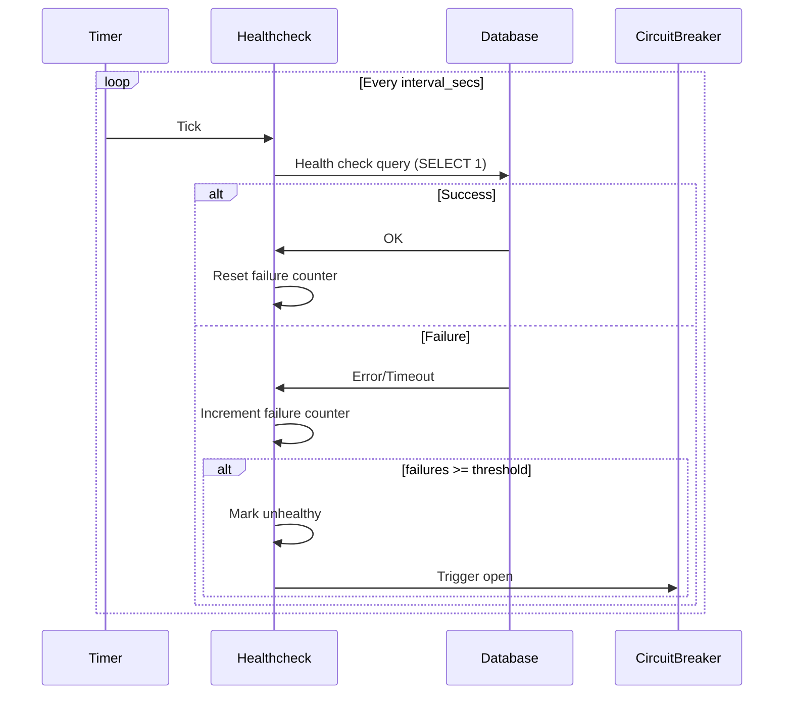

# Health Checks

Scry provides comprehensive health monitoring through active health checks, passive health checks during connection recycling, and predictive health monitoring with anomaly detection.

## Table of Contents

- [Overview](#overview)
- [Active Health Checks](#active-health-checks)
- [Passive Health Checks](#passive-health-checks)
- [Health Monitoring System](#health-monitoring-system)
- [Configuration](#configuration)
- [Monitoring Health Status](#monitoring-health-status)
- [Troubleshooting](#troubleshooting)

## Overview

Scry implements three layers of health monitoring:

```
Layer 1: Active Health Checks
   ↓
Periodic background checks (every 30s default)
Tests database connectivity and responsiveness
Updates health status

Layer 2: Passive Health Checks
   ↓
On-demand during connection pool recycling
Validates connection before reuse
Discards unhealthy connections

Layer 3: Health Monitoring System
   ↓
Tracks metrics baselines using EMA
Detects anomalies (error rate spikes, latency spikes, pool saturation)
Provides predictive warnings
Integrates with circuit breaker
```

## Active Health Checks

Periodic background task that actively tests database health.

### How It Works



### Configuration

| Parameter | Default | Description |
|-----------|---------|-------------|
| `active_enabled` | `true` | Enable active health checks |
| `interval_secs` | `30` | Seconds between health checks |
| `timeout_ms` | `1000` | Health check timeout in milliseconds |
| `failure_threshold` | `3` | Consecutive failures before unhealthy |

```toml
[resilience.healthcheck]
active_enabled = true
interval_secs = 30
timeout_ms = 1000
failure_threshold = 3
```

### Health Check Query

**Postgres**:
```sql
SELECT 1
```

**Characteristics**:
- Fast (~1ms typical)
- Low overhead
- Tests basic connectivity
- No side effects
- Works with any database state

### Failure Handling

**Consecutive failures tracked**:
```
Check 1: ✓ Success (failures: 0)
Check 2: ✓ Success (failures: 0)
Check 3: ✗ Timeout (failures: 1)
Check 4: ✗ Timeout (failures: 2)
Check 5: ✗ Timeout (failures: 3) → Mark Unhealthy
```

**When unhealthy**:
1. Health status → `Unhealthy`
2. Circuit breaker opens (if `use_health_monitor = true`)
3. Requests fail fast
4. Health checks continue every `interval_secs`
5. When check succeeds, status → `Healthy`, circuit may close

### Benefits

- **Proactive Detection**: Find issues before queries fail
- **Circuit Breaker Integration**: Trigger fail-fast mode
- **Continuous Monitoring**: Always watching database health
- **Independent of Load**: Works even with no query traffic

## Passive Health Checks

On-demand health validation during connection pool recycling.

### How It Works

```
Connection returned to pool
         ↓
    Recycle hook
         ↓
  Health check (SELECT 1)
         ↓
   ┌─────┴─────┐
   │  Healthy  │
   └─────┬─────┘
         ↓
   State reset (DISCARD ALL)
         ↓
   Return to pool

If health check fails:
   ↓
Connection discarded
Pool creates new connection on next request
```

### Implementation

From `src/proxy/tcp_pool.rs`:

```rust
async fn recycle(&self, conn: &mut TcpStream) -> RecycleResult {
    // 1. Health check
    if let Err(e) = self.protocol.health_check(conn).await {
        return Err(RecycleError::StaticMessage("Health check failed"));
    }

    // 2. Reset state (DISCARD ALL for Postgres)
    if let Err(e) = self.protocol.reset_connection(conn).await {
        return Err(RecycleError::StaticMessage("State reset failed"));
    }

    Ok(())
}
```

### When Passive Checks Run

Every time a connection is **returned to the pool**:
```
Query completes
      ↓
Return connection to pool
      ↓
Passive health check
      ↓
If pass: connection available for reuse
If fail: connection discarded
```

### Benefits

- **Connection Quality**: Ensures pooled connections are healthy
- **State Consistency**: Clears session state before reuse
- **No Stale Connections**: Detects broken connections immediately
- **Automatic Cleanup**: Failed connections automatically removed

## Health Monitoring System

Advanced monitoring that tracks baseline metrics and detects anomalies using Exponential Moving Average (EMA).

### Architecture

```rust
pub struct HealthMonitor {
    // Tracked metrics with EMA baselines
    error_rate_baseline: f64,           // EMA of error rate
    latency_p99_baseline: f64,          // EMA of P99 latency
    current_error_rate: f64,            // Current error rate
    current_latency_p99: f64,           // Current P99 latency

    // Warnings detected
    warnings: Vec<HealthWarning>,

    // Configuration
    config: HealthConfig,
}
```

### Exponential Moving Average (EMA)

EMA gives more weight to recent values while maintaining history:

```
EMA_new = (alpha × current_value) + ((1 - alpha) × EMA_old)
```

**Alpha** (`ema_alpha`): 0.1 (default)
- Lower alpha: Smoother, slower to adapt
- Higher alpha: More responsive, noisier

**Example**:
```
Time 0: EMA = 10.0 (initial)
Time 1: Current = 12.0 → EMA = (0.1 × 12.0) + (0.9 × 10.0) = 10.2
Time 2: Current = 15.0 → EMA = (0.1 × 15.0) + (0.9 × 10.2) = 10.68
Time 3: Current = 50.0 → EMA = (0.1 × 50.0) + (0.9 × 10.68) = 14.61
                              ↑
                         Spike detected! (50.0 >> 14.61)
```

### Health Status Levels

| Status | Description | Warnings | Circuit Breaker |
|--------|-------------|----------|-----------------|
| **Healthy** | Normal operation | None | Closed |
| **Degraded** | Minor issues detected | Present, not critical | Closed |
| **Unhealthy** | Critical issues detected | Critical warnings | **Opens** |

### Warning Types

#### 1. Error Rate Spike

**Trigger**: `current_error_rate > (error_rate_baseline × error_rate_spike_factor)`

**Configuration**:
```toml
[health]
error_rate_spike_factor = 3.0  # Default
```

**Example**:
```
Baseline error rate: 0.01 (1%)
Current error rate:  0.05 (5%)
Spike factor:        3.0

0.05 > (0.01 × 3.0) = 0.05 > 0.03
→ WARNING: Error rate spike detected
```

**Meaning**: Error rate is significantly higher than learned baseline.

#### 2. Latency Spike

**Trigger**: `current_p99_latency > (latency_p99_baseline × latency_spike_factor)`

**Configuration**:
```toml
[health]
latency_spike_factor = 2.0  # Default
```

**Example**:
```
Baseline P99 latency: 10ms
Current P99 latency:  25ms
Spike factor:         2.0

25ms > (10ms × 2.0) = 25ms > 20ms
→ WARNING: Latency spike detected
```

**Meaning**: Query latency is significantly higher than normal.

#### 3. Pool Saturation

**Trigger**: `pool_utilization > pool_saturation_threshold`

**Configuration**:
```toml
[health]
pool_saturation_threshold = 0.95  # Default (95%)
```

**Example**:
```
Pool utilization: 0.98 (98%)
Threshold:        0.95 (95%)

0.98 > 0.95
→ WARNING: Pool saturation (98%)
```

**Meaning**: Connection pool is nearly exhausted.

#### 4. Pool Starvation (Critical)

**Trigger**: `available_connections == 0 && waiting_requests > 0`

**Example**:
```
Available connections: 0
Waiting requests:      5

→ CRITICAL WARNING: Pool starvation
→ Health status: Unhealthy
→ Circuit breaker: Opens
```

**Meaning**: All connections in use, requests waiting for connections.

### Critical Warnings

These warnings trigger `Unhealthy` status and open circuit breaker:

1. **Pool starvation**: No available connections
2. **Extreme pool saturation**: >99% utilization
3. **Severe error rate spike**: >5x baseline

## Configuration

### Complete Example

```toml
# Active health checks
[resilience.healthcheck]
active_enabled = true
interval_secs = 30
timeout_ms = 1000
failure_threshold = 3

# Health monitoring
[health]
error_rate_spike_factor = 3.0
latency_spike_factor = 2.0
pool_saturation_threshold = 0.95
ema_alpha = 0.1

# Circuit breaker integration
[resilience.circuit_breaker]
use_health_monitor = true
```

### Environment Variables

```bash
# Active health checks
export SCRY_RESILIENCE__HEALTHCHECK__ACTIVE_ENABLED=true
export SCRY_RESILIENCE__HEALTHCHECK__INTERVAL_SECS=30
export SCRY_RESILIENCE__HEALTHCHECK__TIMEOUT_MS=1000
export SCRY_RESILIENCE__HEALTHCHECK__FAILURE_THRESHOLD=3
```

> **Note:** The passive health-monitor thresholds (error-rate/latency spike
> factors, pool-saturation threshold, EMA smoothing) currently use built-in
> defaults and are not yet environment-configurable.

### Tuning for Different Environments

**Sensitive (catch issues early)**:
```toml
[resilience.healthcheck]
interval_secs = 15          # More frequent checks
failure_threshold = 2       # Faster to mark unhealthy

[health]
error_rate_spike_factor = 2.0    # Lower threshold
latency_spike_factor = 1.5       # More sensitive
pool_saturation_threshold = 0.90 # Alert at 90%
```

**Tolerant (avoid false positives)**:
```toml
[resilience.healthcheck]
interval_secs = 60          # Less frequent
failure_threshold = 5       # More tolerant

[health]
error_rate_spike_factor = 5.0    # Higher threshold
latency_spike_factor = 3.0       # Less sensitive
pool_saturation_threshold = 0.98 # Only alert at 98%
```

## Monitoring Health Status

### Health Endpoint

```bash
curl http://localhost:9090/health
```

**Healthy**:
```json
{
  "status": "Healthy",
  "uptime_secs": 3600,
  "queries_total": 10000,
  "error_rate": 0.001,
  "latency_p99_ms": 5.2,
  "pool_utilization": 0.45,
  "warnings": []
}
```

**Degraded**:
```json
{
  "status": "Degraded",
  "uptime_secs": 3605,
  "queries_total": 10100,
  "error_rate": 0.025,
  "latency_p99_ms": 15.0,
  "pool_utilization": 0.96,
  "warnings": [
    {
      "type": "ErrorRateSpike",
      "message": "Error rate (2.5%) is 3.0x baseline (0.8%)"
    },
    {
      "type": "PoolSaturation",
      "message": "Pool utilization at 96%"
    }
  ]
}
```

**Unhealthy**:
```json
{
  "status": "Unhealthy",
  "uptime_secs": 3610,
  "queries_total": 10150,
  "error_rate": 0.80,
  "latency_p99_ms": 100.0,
  "pool_utilization": 1.0,
  "warnings": [
    {
      "type": "PoolStarvation",
      "message": "Pool exhausted, 10 requests waiting"
    },
    {
      "type": "ErrorRateSpike",
      "message": "Error rate (80%) is 5.0x+ baseline"
    }
  ]
}
```

### Prometheus Metrics

Health-related metrics:

```bash
curl http://localhost:9090/metrics | grep -E '(error_rate|pool)'
```

```
scry_query_error_rate 0.025
scry_pool_connections_total 50
scry_pool_connections_available 2
scry_pool_utilization 0.96
```

### Alerts

**Degraded state**:
```promql
scry_health_status == 1
```

**Unhealthy state** (critical):
```promql
scry_health_status == 2
```

**Pool saturation**:
```promql
scry_pool_utilization > 0.95
```

**Error rate spike**:
```promql
scry_query_error_rate > (scry_error_rate_baseline * 3)
```

## Troubleshooting

### Problem: Active Health Checks Failing

**Symptoms**:
- Health status shows `Unhealthy`
- Logs show "Health check failed"
- Circuit breaker opens

**Diagnosis**:
```bash
# Check health status
curl http://localhost:9090/health

# Try health check query manually
psql -h localhost -p 5432 -U postgres -c "SELECT 1"
```

**Possible Causes**:
1. Database down/unreachable
2. Network issues
3. Database overloaded (timeouts)
4. Firewall blocking connections

**Solutions**:
1. Verify database is running:
   ```bash
   docker ps | grep postgres
   ```

2. Check network connectivity:
   ```bash
   telnet localhost 5432
   ```

3. Increase timeout if database is slow:
   ```toml
   [resilience.healthcheck]
   timeout_ms = 5000  # Increase to 5 seconds
   ```

4. Check database logs for errors

### Problem: Frequent Health Status Changes

**Symptoms**:
- Health status flapping between Healthy/Degraded
- Warnings appearing and disappearing
- Circuit breaker flapping

**Diagnosis**:
```bash
# Monitor health status over time
watch -n 1 'curl -s http://localhost:9090/health | jq .status'

# Check metrics
curl http://localhost:9090/metrics | grep -E '(error_rate|latency)'
```

**Solutions**:
1. Adjust EMA alpha for smoother baselines:
   ```toml
   [health]
   ema_alpha = 0.05  # Lower = smoother
   ```

2. Increase spike factors:
   ```toml
   [health]
   error_rate_spike_factor = 5.0
   latency_spike_factor = 3.0
   ```

3. Investigate root cause of variability:
   - Bursty traffic?
   - Database performance issues?
   - Network instability?

### Problem: Pool Saturation Warnings

**Symptoms**:
- Warning: "Pool saturation at 95%+"
- Slow query responses
- High pool utilization

**Diagnosis**:
```bash
curl http://localhost:9090/debug/pool
# {"size": 50, "available": 1, "utilization": 0.98}

curl http://localhost:9090/metrics | grep backend_seconds
# scry_query_backend_seconds{quantile="0.99"} 0.150
```

**Solutions**:
1. **Increase pool size**:
   ```toml
   [backend]
   pool_size = 100  # Increase from 50
   ```

2. **Optimize slow queries** if backend latency high

3. **Scale horizontally**: Add more proxy instances

4. **Verify database can handle load**:
   ```sql
   SHOW max_connections;
   SELECT count(*) FROM pg_stat_activity;
   ```

## See Also

- [Circuit Breaker](circuit-breaker.md) - Integration with circuit breaker
- [Connection Pooling](connection-pooling.md) - Pool management and recycling
- [Metrics](metrics.md) - Health-related metrics
- [Configuration](configuration.md) - Health check configuration reference
