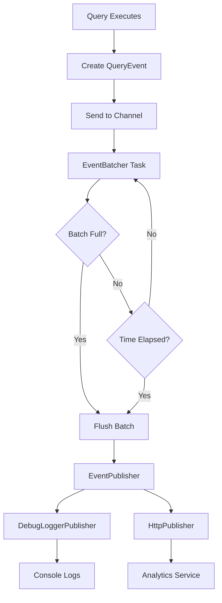

# Observability

Scry provides comprehensive observability into your database queries through a flexible event publishing system. Every query flowing through the proxy generates an event containing metadata about execution, timing, and optional value fingerprints for hot data detection.

## Table of Contents

- [Overview](#overview)
- [Event Publisher Architecture](#event-publisher-architecture)
- [Query Events](#query-events)
- [Event Batching](#event-batching)
- [Publisher Implementations](#publisher-implementations)
- [FlexBuffers Serialization](#flexbuffers-serialization)
- [Configuration](#configuration)
- [Best Practices](#best-practices)

## Overview

Scry's observability system captures rich metadata for every query:

```
Query Execution
      ↓
Extract Metadata (query, timing, success/failure)
      ↓
Create QueryEvent
      ↓
Send to EventBatcher (async, non-blocking)
      ↓
Batch accumulates events
      ↓
Flush on size (100 events) OR time (1000ms)
      ↓
EventPublisher publishes batch
```

**Key Properties**:
- **Non-blocking**: Events published asynchronously, never delay queries
- **Best-effort**: If event queue full, oldest events dropped to protect memory
- **Batched**: Events aggregated for efficient network usage
- **Flexible**: Pluggable publishers (debug, HTTP, future: Kafka, etc.)

## Event Publisher Architecture

The event publishing system uses a trait-based abstraction for flexibility:

```rust
#[async_trait]
pub trait EventPublisher: Send + Sync {
    /// Publish a batch of events
    async fn publish_batch(&self, events: Vec<QueryEvent>) -> Result<()>;

    /// Graceful shutdown with flush
    async fn shutdown(&self) -> Result<()>;
}
```

### Publishers

| Publisher | Use Case | Output |
|-----------|----------|--------|
| **DebugLoggerPublisher** | Development, debugging | JSON logs at DEBUG level |
| **HttpPublisher** | Production | HTTP POST with FlexBuffers payload |

### Flow Diagram



## Query Events

Every query generates a `QueryEvent` struct:

```rust
pub struct QueryEvent {
    /// Unique event ID (UUID v4)
    pub event_id: String,

    /// Event timestamp (UTC)
    pub timestamp: SystemTime,

    /// Query text (raw or anonymized)
    pub query: String,

    /// Normalized query with placeholders (if anonymized)
    pub normalized_query: Option<String>,

    /// Blake3 fingerprints of literal values (if anonymized)
    pub value_fingerprints: Option<Vec<String>>,

    /// Query execution duration
    pub duration: Duration,

    /// Number of rows affected/returned (if available)
    pub rows: Option<u64>,

    /// Whether query succeeded
    pub success: bool,

    /// Error message (if failed)
    pub error: Option<String>,

    /// Database name
    pub database: String,

    /// Connection ID for tracing
    pub connection_id: String,
}
```

### Event Examples

**Successful Query (Anonymized)**:
```json
{
  "event_id": "550e8400-e29b-41d4-a716-446655440000",
  "timestamp": "2025-12-06T10:00:00.123Z",
  "query": "SELECT * FROM users WHERE id = ?",
  "normalized_query": "SELECT * FROM users WHERE id = ?",
  "value_fingerprints": ["blake3:abc123def456..."],
  "duration_ms": 1.23,
  "rows": 1,
  "success": true,
  "error": null,
  "database": "production",
  "connection_id": "conn-123"
}
```

**Failed Query**:
```json
{
  "event_id": "660e9500-f30c-52e5-b827-557766551111",
  "timestamp": "2025-12-06T10:00:01.456Z",
  "query": "SELECT * FROM nonexistent",
  "normalized_query": null,
  "value_fingerprints": null,
  "duration_ms": 0.45,
  "rows": null,
  "success": false,
  "error": "ERROR: relation \"nonexistent\" does not exist",
  "database": "production",
  "connection_id": "conn-123"
}
```

**Raw Query (No Anonymization)**:
```json
{
  "event_id": "770e0600-g41d-63f6-c938-668877662222",
  "timestamp": "2025-12-06T10:00:02.789Z",
  "query": "INSERT INTO users (name, email) VALUES ('Alice', 'alice@example.com')",
  "normalized_query": null,
  "value_fingerprints": null,
  "duration_ms": 2.34,
  "rows": 1,
  "success": true,
  "error": null,
  "database": "production",
  "connection_id": "conn-456"
}
```

## Event Batching

Event batching aggregates multiple events before publishing to reduce network overhead and improve throughput.

### Architecture

```rust
pub struct EventBatcher {
    sender: mpsc::Sender<QueryEvent>,
    // Background task accumulates and flushes
}
```

The batcher runs a background Tokio task that:
1. **Receives events** via bounded channel (`tokio::mpsc`)
2. **Accumulates** events in a buffer
3. **Flushes** when:
   - Batch size threshold reached (default: 100 events)
   - Time interval elapsed (default: 1000ms)
   - Whichever comes first

### Configuration

| Parameter | Default | Description |
|-----------|---------|-------------|
| `batch_size` | 100 events | Flush when batch reaches this size |
| `flush_interval_ms` | 1000ms | Flush every N milliseconds |
| `max_queue_size` | 10000 events | Max events in channel before dropping oldest |

### Memory Safety

The channel is **bounded** with ring buffer semantics:
- Queue fills to `max_queue_size`
- New events replace oldest events if full
- Prevents unbounded memory growth
- Queries never block on event publishing

**Memory Usage**: ~100 bytes per event → 10,000 events ≈ 1MB

### Graceful Shutdown

On shutdown:
1. Stop accepting new events
2. Flush accumulated batch
3. Call `publisher.shutdown()`
4. Wait for final publish to complete

## Publisher Implementations

### DebugLoggerPublisher

Logs events as JSON to console at DEBUG level.

**Use Cases**:
- Local development
- Debugging query issues
- Testing event generation

**Configuration**:
```toml
[publisher]
publisher_type = "debug"
```

**Output** (with `RUST_LOG=debug`):
```
DEBUG scry::publisher::debug_logger: Published batch events=5 total_events=1234 total_batches=13
DEBUG scry::publisher::debug_logger: Event: {"event_id":"550e8400-...","timestamp":"2025-12-06T10:00:00.123Z",...}
```

**Metrics**:
- `total_events`: Total events logged
- `total_batches`: Total batches logged
- `total_bytes`: Total bytes logged (approximate)

### HttpPublisher

Publishes batches to remote HTTP endpoint using FlexBuffers serialization.

**Use Cases**:
- Production deployments
- Central analytics service
- Query performance analysis

**Configuration**:
```toml
[publisher]
publisher_type = "http"
http_endpoint = "https://analytics.example.com/events"
http_timeout_ms = 500
http_max_retries = 2
http_api_key = "sk-..."
http_compression = true
```

**Request Format**:
```
POST /events HTTP/1.1
Host: analytics.example.com
Content-Type: application/x-flexbuffer
Content-Encoding: gzip
Authorization: Bearer sk-...
X-Scry-Proxy-Id: proxy-abc123
X-Scry-Batch-Seq: 42

<FlexBuffers binary payload>
```

**Features**:
- **Retries**: Exponential backoff on failure (max 2 retries default)
- **Timeout**: Configurable request timeout (default 500ms)
- **Compression**: Optional gzip compression (default: enabled)
- **Authentication**: Optional API key via header
- **Sequencing**: Monotonic batch sequence number for ordering

**Metrics**:
- `successful_publishes`: Total successful batch publishes
- `failed_publishes`: Total failed batch publishes
- `batch_seq`: Current batch sequence number

**Error Handling**:
- Retries on network errors, 5xx responses
- No retry on 4xx errors (client errors)
- Failed batches logged and metrics incremented
- Proxy continues operating (best-effort)

### Implementing Custom Publishers

Implement the `EventPublisher` trait:

```rust
pub struct KafkaPublisher {
    producer: FutureProducer,
    topic: String,
}

#[async_trait]
impl EventPublisher for KafkaPublisher {
    async fn publish_batch(&self, events: Vec<QueryEvent>) -> Result<()> {
        let payload = serialize_events(&events)?;

        self.producer
            .send(
                FutureRecord::to(&self.topic).payload(&payload),
                Duration::from_secs(0),
            )
            .await?;

        Ok(())
    }

    async fn shutdown(&self) -> Result<()> {
        self.producer.flush(Duration::from_secs(30)).await?;
        Ok(())
    }
}
```

## FlexBuffers Serialization

Scry uses **FlexBuffers** for efficient binary serialization of event batches.

### Why FlexBuffers?

| Feature | Benefit |
|---------|---------|
| **Schema-less** | No code generation required |
| **Compact** | ~50% smaller than JSON |
| **Fast** | Zero-copy deserialization |
| **Serde Support** | Works with Rust serde |
| **Cross-platform** | FlatBuffers ecosystem support |

### Batch Format

```rust
pub struct QueryEventBatch {
    /// List of events in batch
    pub events: Vec<SerializableEvent>,

    /// Unique proxy instance ID
    pub proxy_id: String,

    /// Monotonic batch sequence number
    pub batch_seq: u64,
}
```

### Serialization

```rust
use flexbuffers::FlexbufferSerializer;

let batch = QueryEventBatch {
    events: vec![/* ... */],
    proxy_id: "proxy-abc123".to_string(),
    batch_seq: 42,
};

let mut s = FlexbufferSerializer::new();
batch.serialize(&mut s)?;
let bytes = s.take_buffer();

// bytes: Vec<u8> ready for HTTP POST
```

### Deserialization (Receiver Side)

```rust
use flexbuffers::Reader;

let root = Reader::get_root(&bytes)?;
let batch: QueryEventBatch = QueryEventBatch::deserialize(root)?;

for event in batch.events {
    println!("Query: {}", event.query);
    println!("Duration: {:?}", Duration::from_micros(event.duration_us));
}
```

### Size Comparison

Example batch (100 events):
- **JSON**: ~50KB
- **FlexBuffers**: ~25KB
- **FlexBuffers + gzip**: ~8KB

**Network savings**: 84% reduction with FlexBuffers + gzip vs JSON

## Configuration

### Complete Example

```toml
[publisher]
# Enable/disable event publishing
enabled = true

# Batch size before flush
batch_size = 100

# Milliseconds between flushes
flush_interval_ms = 1000

# Anonymize queries (see query-anonymization.md)
anonymize = true

# Publisher type: "debug" or "http"
publisher_type = "http"

# Max queued events before dropping oldest
max_queue_size = 10000

# HTTP publisher settings
http_endpoint = "https://analytics.example.com/events"
http_timeout_ms = 500
http_max_retries = 2
http_api_key = "sk-abc123..."
http_compression = true
```

### Environment Variables

```bash
export SCRY_PUBLISHER__ENABLED=true
export SCRY_PUBLISHER__BATCH_SIZE=250
export SCRY_PUBLISHER__FLUSH_INTERVAL_MS=500
export SCRY_PUBLISHER__ANONYMIZE=true
export SCRY_PUBLISHER__PUBLISHER_TYPE=http
export SCRY_PUBLISHER__HTTP_ENDPOINT=https://analytics.example.com/events
export SCRY_PUBLISHER__HTTP_API_KEY=sk-abc123...
```

### Tuning for Different Workloads

**High Throughput** (>1000 qps):
```toml
batch_size = 500           # Larger batches
flush_interval_ms = 2000   # Less frequent flushes
max_queue_size = 50000     # Larger buffer
```

**Low Latency** (real-time analytics):
```toml
batch_size = 10            # Smaller batches
flush_interval_ms = 100    # Frequent flushes
```

**Resource Constrained**:
```toml
batch_size = 50
max_queue_size = 1000      # Smaller memory footprint
http_compression = true    # Reduce bandwidth
```

## Best Practices

### Development

1. **Use DebugLoggerPublisher** for local development
2. **Disable anonymization** to see actual query values
3. **Set `RUST_LOG=debug`** to see event logs

```toml
[publisher]
publisher_type = "debug"
anonymize = false
```

### Production

1. **Use HttpPublisher** with a central analytics service
2. **Enable anonymization** for privacy/compliance
3. **Enable compression** to reduce bandwidth
4. **Set appropriate batch size** for your throughput
5. **Monitor failed publishes** metric
6. **Configure API keys** via environment variables (not config files)

```toml
[publisher]
publisher_type = "http"
anonymize = true
http_compression = true
batch_size = 250
```

```bash
export SCRY_PUBLISHER__HTTP_API_KEY="$SECRET_API_KEY"
```

### Monitoring

Track these metrics:
- `scry_events_sent`: Events successfully queued
- `scry_events_dropped`: Events dropped due to full queue
- `scry_successful_publishes`: Batches successfully published
- `scry_failed_publishes`: Failed batch publishes

Alert if:
- `failed_publishes` increasing (network or service issues)
- `events_dropped` > 0 (queue saturation, increase `max_queue_size`)

### Analytics Service Implementation

Your analytics service should:
1. **Accept HTTP POST** with `Content-Type: application/x-flexbuffer`
2. **Handle gzip** if `Content-Encoding: gzip`
3. **Deserialize FlexBuffers** payload
4. **Validate API key** from `Authorization` header
5. **Process events** asynchronously
6. **Return 200 OK** quickly to avoid timeouts

Example service (pseudo-code):
```python
@app.post("/events")
async def receive_events(request):
    # Validate API key
    if request.headers["Authorization"] != f"Bearer {API_KEY}":
        return 401

    # Decompress if needed
    body = request.body
    if request.headers.get("Content-Encoding") == "gzip":
        body = gzip.decompress(body)

    # Deserialize FlexBuffers
    batch = flexbuffers.loads(body)

    # Process asynchronously
    await process_batch_async(batch)

    return 200
```

## See Also

- [Query Anonymization](query-anonymization.md) - Privacy-preserving query logging
- [Metrics](metrics.md) - Prometheus metrics for monitoring
- [Configuration](configuration.md) - Complete configuration reference
- [Architecture](architecture.md) - Event flow in system architecture
