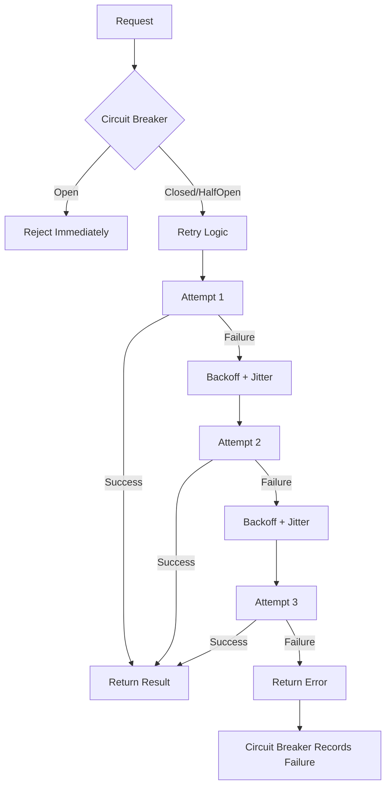

# Resilience

Scry provides production-grade resilience through the integration of circuit breakers, connection retries with exponential backoff, and comprehensive health monitoring. These features work together to protect your database, provide fast failure detection, and enable automatic recovery.

## Table of Contents

- [Overview](#overview)
- [Connection Retry](#connection-retry)
- [Feature Integration](#feature-integration)
- [Configuration](#configuration)
- [Example Scenarios](#example-scenarios)
- [Best Practices](#best-practices)

## Overview

Scry's resilience features work together to handle failures gracefully:

```
┌────────────────────────────────────────────────────┐
│                  Resilience Layer                  │
│                                                    │
│  1. Circuit Breaker                                │
│     ↓                                              │
│     Check if requests allowed                      │
│     If circuit open → Fail fast (<1ms)             │
│                                                    │
│  2. Connection Retry                               │
│     ↓                                              │
│     Exponential backoff with jitter                │
│     Retry on transient failures                    │
│                                                    │
│  3. Health Monitoring                              │
│     ↓                                              │
│     Active checks + Passive checks + EMA tracking  │
│     Predictive circuit opening                     │
│     Anomaly detection                              │
│                                                    │
│  Result: Robust, self-healing system               │
└────────────────────────────────────────────────────┘
```

### Key Benefits

- **Fast Failure**: Circuit breaker fails requests in <1ms when database is down
- **Automatic Recovery**: Retry logic handles transient failures
- **Predictive Protection**: Health monitoring detects issues before they cascade
- **Database Protection**: Prevent overwhelming struggling database
- **Graceful Degradation**: Maintain service during partial outages

## Connection Retry

Automatic retry with exponential backoff for connection failures.

### Algorithm

```
Attempt 1: Try connection
         ↓
    ┌────┴────┐
    │ Success │
    └────┬────┘
         ↓
    Return connection

    ┌────┴────┐
    │ Failure │
    └────┬────┘
         ↓
Wait: initial_backoff + jitter
         ↓
Attempt 2: Try connection
         ↓
    ┌────┴────┐
    │ Success │
    └────┬────┘
         ↓
    Return connection

    ┌────┴────┐
    │ Failure │
    └────┬────┘
         ↓
Wait: initial_backoff × multiplier + jitter
         ↓
Attempt 3: Try connection
         ↓
    ... (up to max_attempts)
         ↓
All attempts failed → Return error
```

### Backoff Formula

```
backoff = min(initial_backoff × multiplier^(attempt-1), max_backoff)
jitter = random(0, backoff × jitter_factor)
total_delay = backoff + jitter
```

**Example** (default settings):
```
initial_backoff_ms = 50
max_backoff_ms = 5000
backoff_multiplier = 2.0
jitter_factor = 0.1

Attempt 1: 50ms + 0-5ms jitter = 50-55ms
Attempt 2: 100ms + 0-10ms jitter = 100-110ms
Attempt 3: 200ms + 0-20ms jitter = 200-220ms
Attempt 4: 400ms + 0-40ms jitter = 400-440ms
Attempt 5: 800ms + 0-80ms jitter = 800-880ms
Attempt 6: 1600ms + 0-160ms jitter = 1600-1760ms
Attempt 7: 3200ms + 0-320ms jitter = 3200-3520ms
Attempt 8: 5000ms (capped) + 0-500ms jitter = 5000-5500ms
```

### Why Exponential Backoff?

**Linear backoff** (50ms, 50ms, 50ms):
- ❌ Too aggressive when database is down
- ❌ Wastes retries quickly
- ❌ May overwhelm recovering database

**Exponential backoff** (50ms, 100ms, 200ms):
- ✓ Gives database time to recover
- ✓ Spreads out retry attempts
- ✓ More retries in total time window

### Why Jitter?

Without jitter, all simultaneous requests retry at the same time:

```
100 requests fail at t=0
All retry at t=50ms (thundering herd!)
All retry at t=100ms
Database overwhelmed
```

With jitter, retries are spread out:

```
100 requests fail at t=0
Retry between t=50-55ms (spread over 5ms)
Retry between t=100-110ms
Database load distributed
```

### Configuration

| Parameter | Default | Description |
|-----------|---------|-------------|
| `enabled` | `true` | Enable connection retry |
| `max_attempts` | `3` | Maximum retry attempts |
| `initial_backoff_ms` | `50` | Initial backoff in milliseconds |
| `max_backoff_ms` | `5000` | Maximum backoff in milliseconds |
| `backoff_multiplier` | `2.0` | Backoff multiplier per attempt |
| `jitter_factor` | `0.1` | Jitter factor (0.0-1.0) |

```toml
[resilience.connection_retry]
enabled = true
max_attempts = 3
initial_backoff_ms = 50
max_backoff_ms = 5000
backoff_multiplier = 2.0
jitter_factor = 0.1
```

### When Retry Happens

Retry logic applies to **connection failures only**:

✓ **Retried**:
- Connection refused (database down)
- Connection timeout
- Network unreachable
- TLS handshake failed

✗ **Not Retried**:
- Authentication failed (wrong credentials)
- Query syntax error
- Permission denied
- Circuit breaker open (fail fast)
- Pool closed or misconfiguration (permanent — fail fast)

Retries wrap **connection acquisition only** — never query execution — so no
query (idempotent or not) is ever replayed. An explicit classifier decides
retryability: transient backend/transport failures and acquisition timeouts are
retried; permanent errors (closed pool, runtime/configuration errors) are not.

## Feature Integration

### Circuit Breaker + Retry



**Benefits**:
1. Circuit breaker prevents retries when database is known down
2. Retry handles transient network issues
3. Circuit breaker learns from retry failures

### Health Monitor + Circuit Breaker

```
Health Monitor
      ↓
Tracks error rate, latency, pool utilization
      ↓
Detects anomalies using EMA baselines
      ↓
Status: Healthy / Degraded / Unhealthy
      ↓
If Unhealthy → Circuit Breaker Opens
      ↓
Requests fail fast without hitting database
      ↓
Health checks continue in background
      ↓
When health improves → Circuit may close
```

**Benefits**:
1. **Predictive**: Circuit opens before failures cascade
2. **Data-driven**: Based on actual metrics, not just failure counts
3. **Adaptive**: Learns baseline behavior over time

### Health Monitor + Connection Pool

```
Connection Pool Recycle
      ↓
Passive Health Check (SELECT 1)
      ↓
If fail → Discard connection
      ↓
Health Monitor tracks metrics
      ↓
Pool utilization high → Pool Saturation warning
      ↓
Pool exhausted → Pool Starvation (critical) → Circuit opens
```

**Benefits**:
1. Only healthy connections returned to pool
2. Pool saturation detected early
3. Pool starvation triggers circuit breaker

### All Features Together

**Normal Operation**:
```
Request → Circuit Breaker (Closed) → Pool → Database
Health Monitor: Healthy
Retry: Not needed
```

**Transient Failure**:
```
Request → Circuit Breaker (Closed) → Pool → Connection attempt fails
       → Retry 1 (backoff 50ms) → Success
Health Monitor: Healthy (single failure doesn't trigger warning)
Circuit Breaker: Closed (failure reset on success)
```

**Database Outage**:
```
t=0:    Request → Circuit Breaker (Closed) → Retry 1,2,3 all fail
        Circuit Breaker: failures += 1

t=1:    Request → Circuit Breaker (Closed) → Retry 1,2,3 all fail
        Circuit Breaker: failures += 1
        ...

t=5:    Request → Circuit Breaker: failures >= 5 → Opens
        Health Monitor: Unhealthy (error rate spike, pool starvation)

t=6:    Request → Circuit Breaker (Open) → Reject (<1ms)
        No retries attempted
        Database protected from connection flood

t=66:   Circuit Breaker → HalfOpen (60s timeout)
        Request → Allowed through → Tests database
        Still down → Circuit → Open

t=126:  Circuit Breaker → HalfOpen
        Database recovered
        Request → Success → Circuit → Closed
        Normal operation resumes
```

## Configuration

### Complete Resilience Configuration

```toml
# Circuit Breaker
[resilience.circuit_breaker]
enabled = true
failure_threshold = 5
success_threshold = 2
open_timeout_secs = 60
use_health_monitor = true

# Connection Retry
[resilience.connection_retry]
enabled = true
max_attempts = 3
initial_backoff_ms = 50
max_backoff_ms = 5000
backoff_multiplier = 2.0
jitter_factor = 0.1

# Active Health Checks
[resilience.healthcheck]
active_enabled = true
interval_secs = 30
timeout_ms = 1000
failure_threshold = 3

# Health Monitoring
[health]
error_rate_spike_factor = 3.0
latency_spike_factor = 2.0
pool_saturation_threshold = 0.95
ema_alpha = 0.1
```

### Environment Variables

```bash
# Circuit Breaker
export SCRY_RESILIENCE__CIRCUIT_BREAKER__ENABLED=true
export SCRY_RESILIENCE__CIRCUIT_BREAKER__FAILURE_THRESHOLD=5
export SCRY_RESILIENCE__CIRCUIT_BREAKER__USE_HEALTH_MONITOR=true

# Connection Retry
export SCRY_RESILIENCE__CONNECTION_RETRY__ENABLED=true
export SCRY_RESILIENCE__CONNECTION_RETRY__MAX_ATTEMPTS=3
export SCRY_RESILIENCE__CONNECTION_RETRY__INITIAL_BACKOFF_MS=50

# Health Checks
export SCRY_RESILIENCE__HEALTHCHECK__ACTIVE_ENABLED=true
export SCRY_RESILIENCE__HEALTHCHECK__INTERVAL_SECS=30
```

### Tuning by Environment

**Development** (fast feedback):
```toml
[resilience.circuit_breaker]
failure_threshold = 3
open_timeout_secs = 10

[resilience.connection_retry]
max_attempts = 2
initial_backoff_ms = 10
```

**Production** (balanced):
```toml
[resilience.circuit_breaker]
failure_threshold = 5
open_timeout_secs = 60

[resilience.connection_retry]
max_attempts = 3
initial_backoff_ms = 50
```

**High-Availability** (aggressive recovery):
```toml
[resilience.circuit_breaker]
failure_threshold = 10
open_timeout_secs = 30
use_health_monitor = true

[resilience.connection_retry]
max_attempts = 5
max_backoff_ms = 10000

[resilience.healthcheck]
interval_secs = 15
```

## Example Scenarios

### Scenario 1: Brief Network Blip

```
10:00:00 - Network hiccup
10:00:01 - Request 1: Connection attempt 1 fails
                      Retry 1 (50ms backoff): Success
         - Circuit Breaker: Closed (success resets failures)
         - Health Monitor: Healthy (single failure below threshold)

Result: Request succeeds with ~50ms added latency
```

### Scenario 2: Database Restart

```
10:00:00 - Database restart initiated
10:00:01 - Request 1: All 3 retry attempts fail (failures: 1)
10:00:02 - Request 2: All 3 retry attempts fail (failures: 2)
10:00:03 - Request 3: All 3 retry attempts fail (failures: 3)
10:00:04 - Request 4: All 3 retry attempts fail (failures: 4)
10:00:05 - Request 5: All 3 retry attempts fail (failures: 5)
         - Circuit Breaker: Opens
10:00:06 - Request 6-100: Rejected immediately (fail fast)
10:00:20 - Database fully online
10:01:05 - Circuit → HalfOpen (60s timeout)
10:01:06 - Request 101: Retry 1 succeeds
         - Circuit Breaker: Closed (successes: 2)
10:01:07 - Normal operation resumes

Result: 6-100 failed fast, automatic recovery
```

### Scenario 3: Degrading Database Performance

```
10:00:00 - Database starts slowing down
10:00:05 - Health Monitor: P99 latency 20ms (baseline: 10ms)
         - Status: Degraded (latency spike)
10:00:10 - Pool utilization: 96% (threshold: 95%)
         - Warning: Pool saturation
10:00:15 - Pool utilization: 100%, 10 requests waiting
         - Warning: Pool starvation (critical)
         - Health Monitor: Unhealthy
         - Circuit Breaker: Opens (predictive)
10:00:16 - Requests fail fast, database load reduces
10:00:30 - Database recovers under reduced load
10:01:15 - Circuit → HalfOpen
10:01:16 - Requests succeed
         - Health Monitor: Pool utilization dropping
         - Circuit → Closed
10:01:20 - Normal operation resumes

Result: Circuit opened *before* database crashed
```

## Best Practices

### 1. Enable All Features

All resilience features work better together:

```toml
[resilience.circuit_breaker]
enabled = true
use_health_monitor = true

[resilience.connection_retry]
enabled = true

[resilience.healthcheck]
active_enabled = true
```

### 2. Monitor Metrics

Track these metrics to understand resilience behavior:

```promql
# Circuit breaker state
scry_circuit_breaker_state

# Retry attempts
rate(scry_connection_retry_attempts_total[5m])

# Health status
scry_health_status

# Pool utilization
scry_pool_utilization
```

### 3. Alert on Critical Events

```promql
# Circuit opened
changes(scry_circuit_breaker_state[5m]) > 0 and scry_circuit_breaker_state == 1

# Unhealthy status
scry_health_status == 2

# Frequent retries
rate(scry_connection_retry_attempts_total[5m]) > 10
```

### 4. Test Resilience Features

**Test circuit breaker**:
```bash
# Stop database
just postgres-down

# Trigger requests
for i in {1..10}; do curl http://localhost:9090/health; sleep 1; done

# Observe circuit opening in metrics
curl http://localhost:9090/metrics | grep circuit_breaker_state

# Restart database
just postgres-up

# Watch automatic recovery
watch -n 1 'curl -s http://localhost:9090/metrics | grep circuit_breaker_state'
```

**Test retry logic**:
```bash
# Brief network interruption simulation
sudo iptables -A OUTPUT -p tcp --dport 5432 -j DROP
sleep 2
sudo iptables -D OUTPUT -p tcp --dport 5432 -j DROP

# Check logs for retry attempts
docker logs scry | grep -i retry
```

### 5. Tune for Your Workload

Consider:
- **Traffic patterns**: Bursty vs steady?
- **Database characteristics**: Fast vs slow queries?
- **Failure patterns**: Transient vs prolonged outages?
- **SLA requirements**: How much downtime acceptable?

Adjust thresholds accordingly.

### 6. Document Incident Response

When circuit breaker opens:
1. Check health endpoint: `curl http://localhost:9090/health`
2. Check database status: Is it running? Overloaded?
3. Review metrics: What triggered the circuit?
4. Decide: Wait for auto-recovery or intervene?
5. Monitor recovery: Circuit transitions to HalfOpen → Closed?

## See Also

- [Circuit Breaker](circuit-breaker.md) - Circuit breaker details
- [Health Checks](health-checks.md) - Health monitoring system
- [Connection Pooling](connection-pooling.md) - Pool integration
- [Configuration](configuration.md) - Complete configuration reference
- [Metrics](metrics.md) - Resilience metrics
